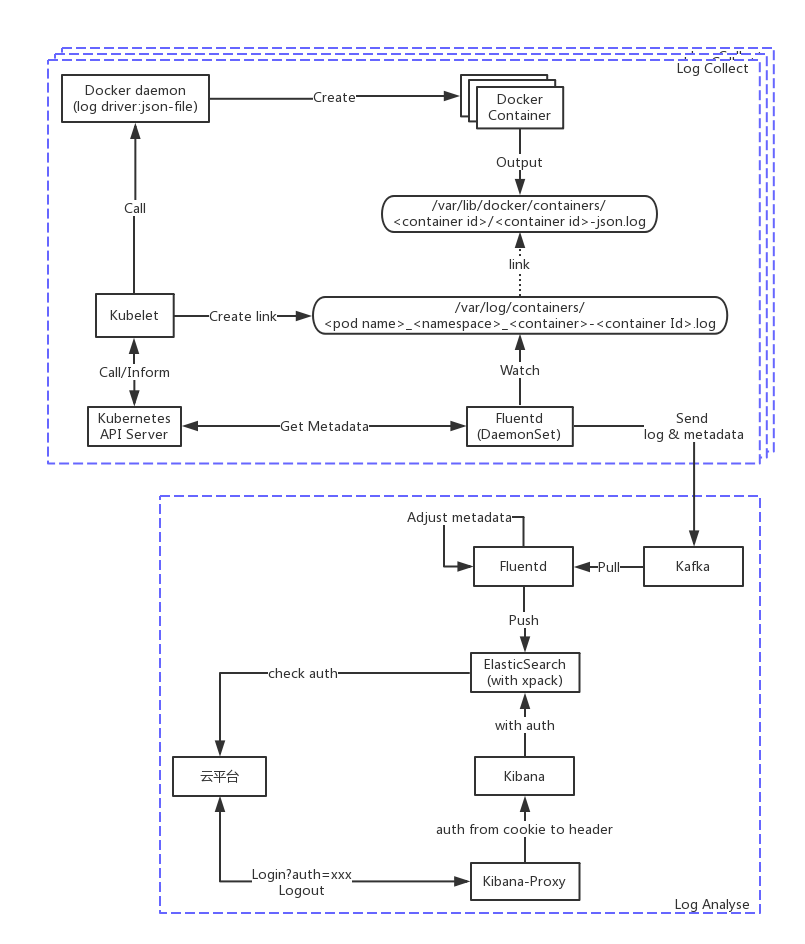

# EFK in Kubernetes
##  1. 概述

企业中常用的日志系统莫过于ELK，即Elasticsearch（简称ES）、Logstash和Kibana。
- Logstash：负责收集日志
- Elasticsearch：负责日志的存储和检索
- Kibana：向用户提供查询和显示的操作界面。

由于Logstash是用JRuby开发的，需要JVM才能运行，作为日志采集器显得有些庞大。因此我们把Logstash换成了Fluentd。Fluentd是用ruby开发的，内存开销只有Logstash的十分之一，而且有很多插件，方便与其它工具集成。最关键的Fluentd有一个**kubernetes_metadata_filter**的插件可以在原始的日志内容上附加kubernetes的信息。

本文介绍了在多个kubernetes集群中收集日志的方案，涉及到日志的采集，传送，存储，认证和授权等方面的内容。

##  2. 总体架构

如下图所示，日志系统由两部分组成：**日志采集**和**日志分析**。
- 日志采集：运行于Kubernetes集群内部，通过DaemonSet的方式收集每个Node上的日志。
- 日志分析：可以独立于Kubernetes集群之外，通过Kafka收集Fluentd采集的各Node上的日志。

目前，我们的架构中，有多个Kubernetes集群，各集群的日志都发到同一个日志分析模块。


##  3. 日志采集
### a. Docker日志驱动的选择

日志采集通过Fluentd从Docker容器中收集日志。Docker有几种日志驱动可以用于Fluentd收集日志：
- json-file：容器日志以json格式写进文件，fluentd用tail收集。
- syslog：fluentd以syslog方式收集，容器日志发送给fluentd打开的syslog监听端口。
- journald：容器日志写入journald，fluentd安装systemd插件，收集journald的日志。
- fluentd：容器日志直接发送给fluentd，fluentd以forward方式打开监听，接收容器日志。

我们不但要收集容器的日志，还要使用fluentd的kubernetes_metadata_filter插件在日志上附加上Kubernetes的元数据。kubernetes_metadata_filter只支持journald和json-file两种驱动，所以我们的选择范围也就集中到这两种方式上。另外，docker logs命令也只支持json-file和journald两种试，如果配置成其它驱动方式，将不能使用docker logs命令。

最终我们选择了json-file驱动，这也是Docker的默认驱动，我们比较熟悉。json-file还可以通过log-opts设置每个容器的日志文件的大小和数量，方便预留日志存储空间。fluentd自带的tail模块就可以收集日志文件，如果用journald，还需要为fluentd额外安装插件。

### b. Kubernetes日志与Docker日志的关系

如果Docker配置的是json-file日志驱动，那么kubelet在启动容器时，会同时创建一个符号链接到Docker容器的日志文件。
kubernetes的日志文件默认存储在 **/var/log/containers/** 目录下，以pod名_namespace_container名_containerId.log命名。
这个文件是一个符号链接，链接到Docker容器的日志文件。Docker日志文件默认在 **/var/lib/docker/containers/containerId/** 目录下，以containerId-json.log命名。fluentd可以监视 **/var/log/containers/** 目录，收集此目录下的文件内容。

### c. kuberntetes_metadata_filter插件的工作原理

fluentd的kubernetes_metadata_filter插件通过分析/var/log/conatiners/目录下日志文件的名称，提取出namespace和Pod名称。然后插件再调用Kubernetes的API Server的接口，查询出Pod的其它信息，再将查询出的Pod元数据附加到每条日志上。为了减少对API Server的查询频率，插件缓存了Kubernetes的Pod信息，不需要每条日志都向API Server查询。插件向日志中增加的Pod的元数据包括：namespace名称、pod的Id、pod的名称、pod的labels、pod所在的host（nodeName)、master_url和pod的annotations。

### d.  Fluentd的部署

Fluentd通过Kubernetes的DaemonSet部署，在每个Node节点启动一个Fluentd Pod收集本节点的Pod日志。[Yaml文件](./fluentd_daemonset.yaml)供大家参考。有几点说明：
- 因为我们的Kubernetes集群启用了RBAC，所以要为Fluentd配置权限。我们创建了名为fluentd的ServiceAccount、ClusterRole和ClusterRoleBinding。
- 目前Fluentd的配置存储在ConfigMap中，通过Volume挂载入容器，将来计划将固定的配置直接写入fluentd的镜像。
- Fluentd需要把主机的/var/lib/docker/containers和/var/log两个目录挂载入容器中。
- 关于Fluentd镜像，现阶段只是在官方v0.12版本镜像的基础上增加了所需的插件，并且以root用户运行，因为/var/lib/docker/containters下的内容只能是root用户才能读取。
- Fluentd并不需要容器网络，所以使用了hostNetwork
- 我们额外配置了kubernetes_url，没有用Kubernetes注入的kubernetes服务的连接信息，这样可以不依赖kube-proxy。
- kubernetes_url使用了本地域名k8s.local，我们在每个node的/etc/hosts中配置了k8s.local的IP地址，由于我们使用提hostNetwork在容器中可以加载到node的/etc/hosts内容。

##  4. 日志传输
### a. 写入Kafka中转
我们使用了Kafka作为日志传输的中转站，原因如下：
- 虽然Fluentd可以直接将日志写入ES，但我们担心如果ES的写入速度过慢可能会造成日志堆积，毕竟Fluentd的本地缓存有限。
- 我们有异地的Kubernetes集群需要通过公网传输日志，Kafka的日志压缩功能可以减少公网传输量。
- 在日志存入ES前，我们希望对日志做进一步的加工。

综上所述，我们在日志分析侧设置了Kafka，各Kubernetes集群的日志由Fluentd发送到Kafka，每个Kubernetes使用同一个topic发送日志到Kafka。

### b. 从Kafka拉取日志

从Kakfa拉取日志并写入到ES，我们同样使用了Fluentd完成。这得益于Fluentd丰富的插件。我们的日志分析侧同样是部署在一个Kubernetes集群中。从Kafka拉取日志的Fluentd以Deployment的方式部署。

### c. 日志转换

采集到Kafka的日志以Kubernetes视角来观察的，但并不完全符合用户的视角。我们想在日志写入ES前做进一步转换。我们通过Fluentd的record_transformer插件完成转换。我们做了如下转换：
- 提取项目和模块信息，我们是以项目和模块两级管理用户Pod的，项目对应Kubernetes的namespace，而模块是在Pod的labels中用MODULE标签标识。
- 提取集群名称，集群名称从Kafka的topic中提取。
- Pod的元数据保留下Pod的名称、Pod的Id、容器名和主机名，其它的清除。
- 时间转换，从原始的日志时间中提取出纳秒。因为ES的时间精度只能到毫秒，但日志中的时间精度到纳秒。
- 生成ES的文档Id，文档Id以pod id+容器名+秒+纳秒生成，为减小文档Id长度，其中的可数字化部分转成36进制的字符串表示。可以保证每条日志的文档Id都不同，可以实现日志重新采集后内容不重复.
- 生成ES的index，以log-项目名-模块名表示。

### d. 输出到ES

Fluentd输出到ES使用ElasticSearch插件完成。我们在使用插件时配置了template_file。Fluentd将在ES中创建一个template，并用这个template创建index。
ES中通过X-Pack设置了密码和权限，所以此处也需要设置ES的账号和密码。密码存储在Kubernetes的Secret中。
[Yaml文件](./fluentd_deployment.yaml)供大家参考

##  5. ElasticSearch
### a. 自定义认证

ES也采用Docker镜像部署，我们发现ES的官方镜像中已经带了x-pack插件（试用版）。x-pack插件中security模块提供了用户认证和授权的功能。我们希望能够做到云平台帐户跟ES的帐户打通。ES支持的认证类型有一种Custom Realm类型。这种类型支持用户自己编写认证插件。ES也提供了认证插件的示例工程。

认证流程如下图所示：
1. 在ES中安装开发的认证插件。
2. 在ES的配置项中配置使用插件。
3. 插件主要实现了两个接口：supports()和authenticate()。
4. ES首先调用supports()接口，询问插件是否支持当前的token，如果supports()返回true则ES会调用authenticate()完成认证。
    -  插件会调用云平台的认证接口认证token是否合法。
    - 未避免云平台的认证接口调用太频繁，插件使用了本地缓存，在认证一次成功后，认证信息进入本地缓存，在一小段时间内不再调用云平台的认证接口。
    - authenticate()认证通过后返回User对象。User对象包含用户名和角色信息。
5. 如果supports()接口返回不支持或authenticate()认证失败，ES会尝试配置的下一种认证方法。


### b. 授权

在authenticate()返回的User对象中的角色（Role）信息包含两个角色：base和与用户名同名的角色。base角色包含了基础授权比如对.kibana的授权。与用户名同名的角色，由云平台调用x-pack的接口创建，指名当前用户可以访问哪些indice。

### c. 配置

关于x-pack的配置如下，我们只需要x-pack的安全功能，把其它功能关闭，并配置了自定义认证和原生认证同时生效，但自定义认证的优先级更高。

```
xpack.monitoring.enabled: false
xpack.watcher.enabled: false
xpack.ml.enabled: false
xpack.security.authc:
  realms:
    custom:
      type: bwae
      order: 0
      checkURL: ${BWAE_REALM_CHECK_URL}
    native:
      type: native
      order: 100
```
##  6. Kibana
### a. 镜像制作

官方给的Kibana镜像 **docker.elastic.co/kibana/kibana:5.4.3** 也是带x-pack的，我们只需要x-pack的security功能，所以我们在配置中把x-pack的其它功能禁用：
```
xpack.monitoring.enabled: false
xpack.watcher.enabled: false
xpack.reporting.enabled: false
xpack.ml.enabled: false
```
Kibana在第一次启动时会做一些优化工作，优化时间通常需要几分钟，这一点与云原生的"快速启动"原则是相违背的。因此需要把优化的结果也写入到镜像中。我们使用的一个技巧是：先占用Kibana的默认端口5601，再启动Kibana，等Kibana完成优化真正运行时发现端口占用，自然就退出了，但优化的结果保存在了镜像中。具体的Dockerfile如下：

```
FROM docker.elastic.co/kibana/kibana:5.4.3
USER root
RUN yum update -y && yum install -y nc && yum clean all
USER kibana
COPY kibana.yml /usr/share/kibana/config/
RUN (nc -l 5601 &) && (kibana 2>&1; exit 0)
```
### b. 登录认证

查看Kibana的源码后我们发现：
1. Kibana本身不做认证，它的认证都是调用ES的认证接口
2. Kibana有两处登录方式：基于Cookie的和Basic Auth

我们采用Basic Auth配合nginx打通Kibana和云平台之间的认证，主要流程如下图所示：
1. 云平台生成一个访问Kibana的带认证token的URL，形如http://kibana....com?auth=xxxxx
2. auth的值是通常当前用户sessionId加密后得到。（加密算法不重要，因为解密也是在云平台中完成。加密的目的只是避免sessionId泄露。）
3. 使用nginx反向代理Kibana。
4. nginx先把auth=xxxx写入到cookie中。
5. 后面的每次请求，nginx从cookie中读出auth，然后写入Basic Auth认证信息。
6. Kibana也使用Basic Auth向ES认证，而ES中配置的认证插件会向云平台验证auth的值，验证通过后云平台将返回登录的用户名。

